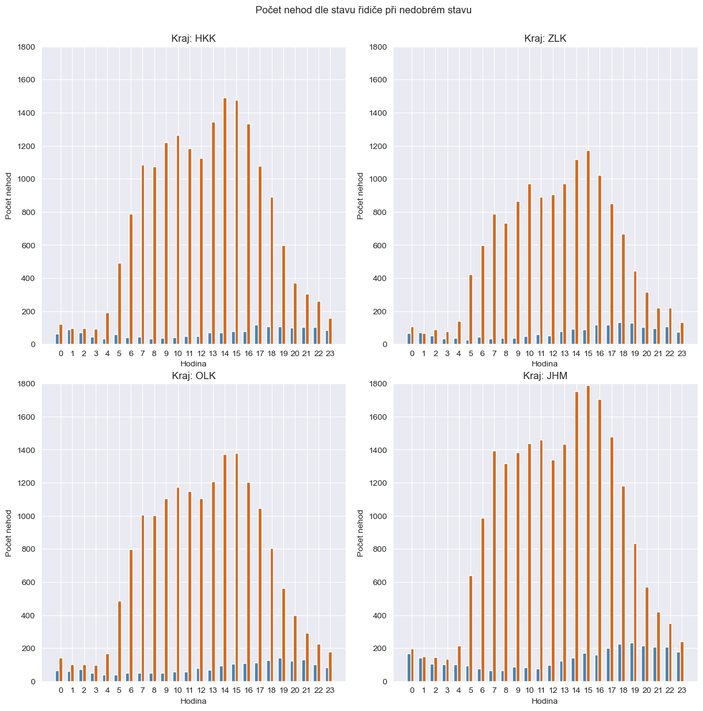
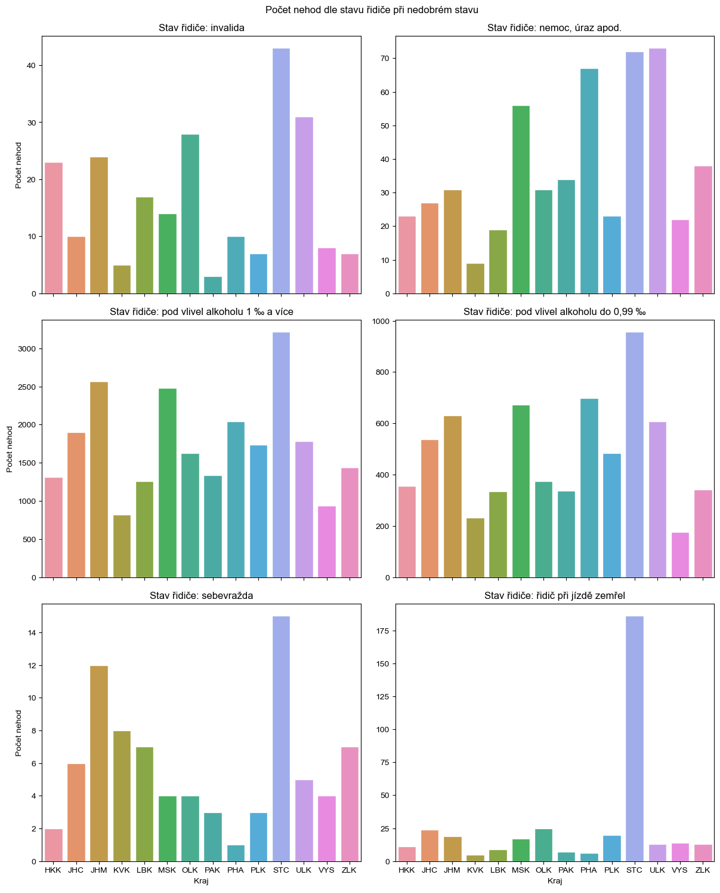
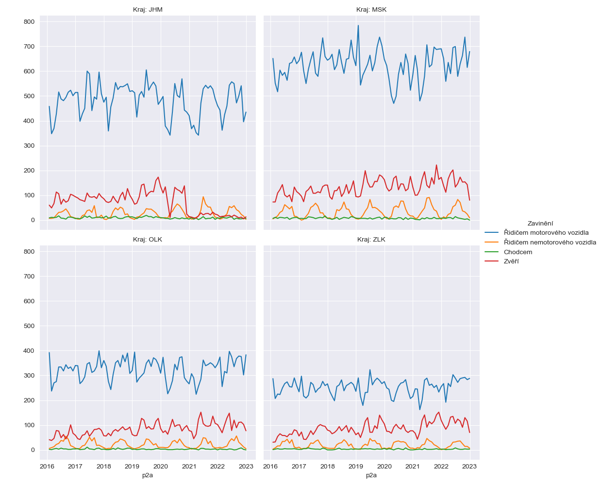

# Accident Data Analysis and Visualization (Python, 2023)

This project is the second part of a university assignment focused on analyzing traffic accident data provided by the Czech Police. The goal was to load, process, and visualize key patterns in the dataset using Python.

## What I Did

- **Loaded and combined** accident data from ZIP archives containing CSV files for each Czech region and year.
- **Cleaned and formatted** the data using pandas:
  - Parsed dates
  - Optimized memory usage with categorical types
  - Removed duplicates
- **Visualized insights** using seaborn and matplotlib:
  - Accident causes by driver condition
  - Alcohol involvement across hours
  - Accident responsibility over months

## Technologies Used

- Python
- pandas
- seaborn
- matplotlib
- zipfile

### 🚗 Accidents involving impaired drivers vs all accidents by region

### 🧠 Accidents by type of driver impairment

### 🐾 Accidents by cause (vehicle drivers, pedestrians, animals)

